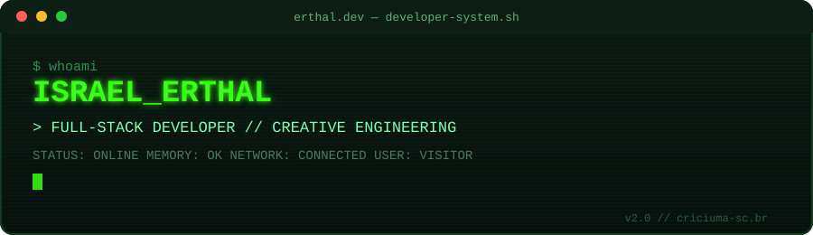
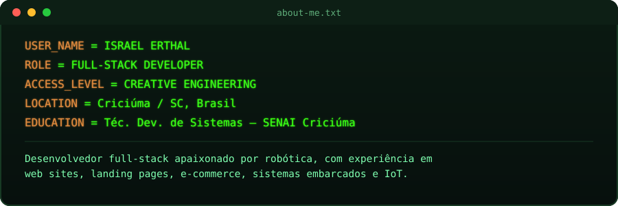
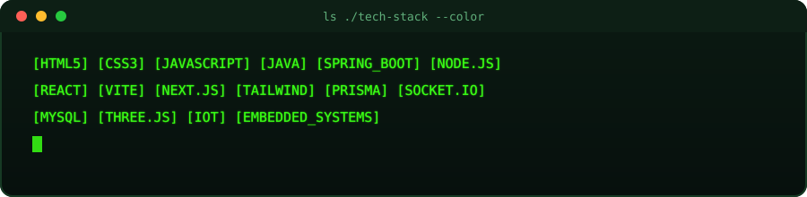
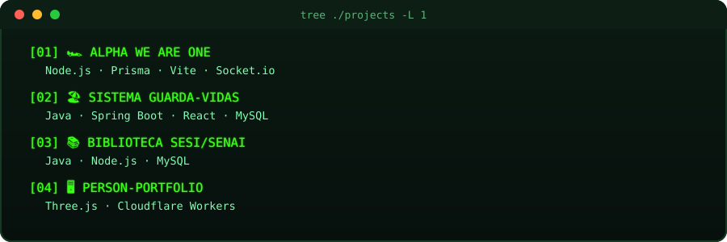
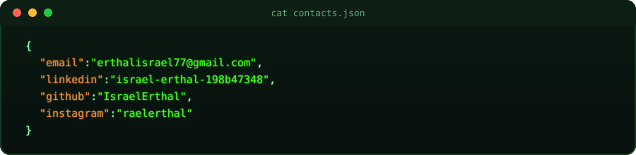

  

  

  

 

**`[01]`** [Alpha We Are One](https://alphaweareone.com.br/) — site oficial da Alpha Scuderia, equipe de STEM Racing 5ª colocada no mundial 25/26 · [repo](https://github.com/IsraelErthal/alpha-pit-display/)
**`[02]`** [Sistema Guarda-Vidas](https://github.com/IsraelErthal/projetoGuardaVidas) — check-in/check-out dos guarda-vidas de Arroio do Silva/SC, demanda do Corpo de Bombeiros de Criciúma
**`[03]`** [Biblioteca SESI/SENAI](https://github.com/IsraelErthal/projetobiblioteca) — reservas de salas/computadores com relatórios e gráficos
**`[04]`** [Portfólio Interativo](https://person-portfolio.erthalisrael77.workers.dev/) — sistema em Three.js · [repo](https://github.com/IsraelErthal/person-portfolio)

 

  

  

`SYSTEM: ONLINE` · `NETWORK: CONNECTED` · `STATUS: OPEN TO WORK`

